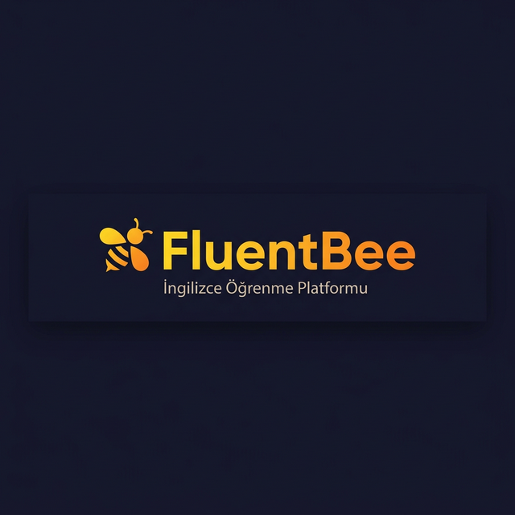

<p align="center">
  
</p>

# FluentBee — İngilizce Öğrenme Platformu

> Yazılım Mühendisliği dersi kapsamında geliştirilmiş, yapay zeka destekli modern İngilizce öğrenme ve pratik yapma platformu.

[](https://yazilimmuh1-sxgy.vercel.app)
[](https://yazilimmuh1-1.onrender.com)
[](https://nextjs.org)
[](https://dotnet.microsoft.com)

---

## 🎬 Proje Tanıtım Videoları

### 👤 Enes Celal Yavuz — Demo Videosu
[](https://www.youtube.com/watch?v=Ffh-dk_AuI8)

### 👤 Ali Şeker — Demo Videosu
[](https://www.youtube.com/watch?v=pAtnr2aewHQ)

---


## 🌐 Canlı Deployment Adresleri

| Servis | URL |
|---|---|
| 🖥️ **Web Frontend** | https://yazilimmuh1-sxgy.vercel.app |
| 🔧 **REST API** | https://yazilimmuh1-1.onrender.com |
| 📮 **Postman Koleksiyonu** | [FluentBee_API.postman_collection.json](./FluentBee_API.postman_collection.json) |

---

## 🛠️ Kullanılan Teknolojiler

| Katman | Teknoloji |
|---|---|
| Frontend | Next.js 15, TypeScript, Tailwind CSS |
| Backend | .NET 9 Web API (C#) |
| Veritabanı | SQLite (Render üzerinde kalıcı disk) |
| Yapay Zeka | Google Gemini 2.0 Flash API |
| CI/CD | GitHub → Vercel (Frontend) + Render (Backend) |

---

## 📁 Proje Yapısı

```
yazilimmuh1/
├── frontend/          # Next.js Web Uygulaması
├── backend/           # .NET Core REST API
├── Ali-Seker/         # Ali Şeker görev dokümantasyonu
├── Enes-Celal-Yavuz/  # Enes Celal Yavuz görev dokümantasyonu
├── API-Tasarimi.md    # Tüm API endpoint dokümantasyonu
└── FluentBee_API.postman_collection.json
```

---

## 👥 Ekip & Gereksinimler

### Enes Celal Yavuz
| # | Gereksinim | Metot |
|---|---|---|
| 1 | Öğrenci Kayıt Olma | POST |
| 2 | Profil Güncelleme | PUT |
| 3 | Kelimeleri Listeleme | GET |
| 4 | Kelime Silme (Favoriden) | DELETE |
| 5 | Dersleri Listeleme | GET |
| 6 | Çalışma Hedefi Güncelleme | PUT |
| 7 | Favori Kelime Ekleme | POST |
| 8 | Öğrenme İstatistiklerini Görme | GET |

📂 [Enes'in Detaylı Görev Dosyaları →](./Enes-Celal-Yavuz/)

### Ali Şeker
| # | Gereksinim | Metot |
|---|---|---|
| 1 | Kursa Katılma | POST |
| 2 | Sınav Sonucu Ekleme | POST |
| 3 | Sınavları Listeleme | GET |
| 4 | Sınav Puanı Güncelleme | PUT |
| 5 | Kullanıcı Hesabını Silme | DELETE |
| 6 | Yorum Silme | DELETE |
| 7 | Sertifikaları Görme | GET |
| 8 | **⭐ Yapay Zeka ile İngilizce Pratiği (+5 Puan)** | POST |

📂 [Ali'nin Detaylı Görev Dosyaları →](./Ali-Seker/)

---

## 🚀 Özellikler

- 📚 **Dersler** — Seviyeye göre filtrelenmiş İngilizce ders modülleri, Markdown içerik renderer
- 📖 **Sözlük** — 50+ kelimelik sözlük, favori kelime ekleme/kaldırma, anlık arama
- 🎓 **Sınavlar** — A1/B1/C1 seviye sınavları, otomatik puanlama, sertifika sistemi
- 🤖 **AI Tutor** — Google Gemini ile anlık İngilizce dilbilgisi geri bildirimi
- 👤 **Profil** — İstatistik gösterimi, ad/şifre güncelleme, sınav geçmişi, sertifika indirme
- 💬 **Yorumlar** — Derslere yorum yapma, silme
- 🏆 **Günlük Hedef** — Kullanıcı belirlediği günlük çalışma hedefine ulaşınca bildirim alır

---

## 📖 Dokümantasyon

- [API Tasarımı](./API-Tasarimi.md)
- [Deployment Kılavuzu](./DEPLOYMENT_GUIDE.md)
- [REST API — Ali Şeker](./Ali-Seker/Ali-Seker-Rest-API-Gorevleri.md)
- [REST API — Enes Celal Yavuz](./Enes-Celal-Yavuz/Enes-Celal-Yavuz-Rest-API-Gorevleri.md)
